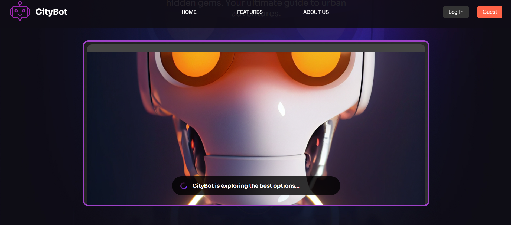

# CityBot

## Table of Contents
1. 🤖 [Introduction](#introduction)
2. ⚙️ [Tech Stack](#tech-stack)
3. 🔋 [Features](#features)
4. 🤸 [Quick Start](#quick-start)

## Introduction
CityBot is a chatbot designed to provide users with information about various events, such as concerts, exhibitions, and theatre plays. Its goal is to make it easier for users to discover local activities and services.

## Tech Stack
- Frontend: React
- Backend: Node.js, Express.js
- Database: MySQL
- API Testing: Postman

## Features
- Interactive event searching
- User-friendly interface
- Support for various event types
- Dynamic response generation

