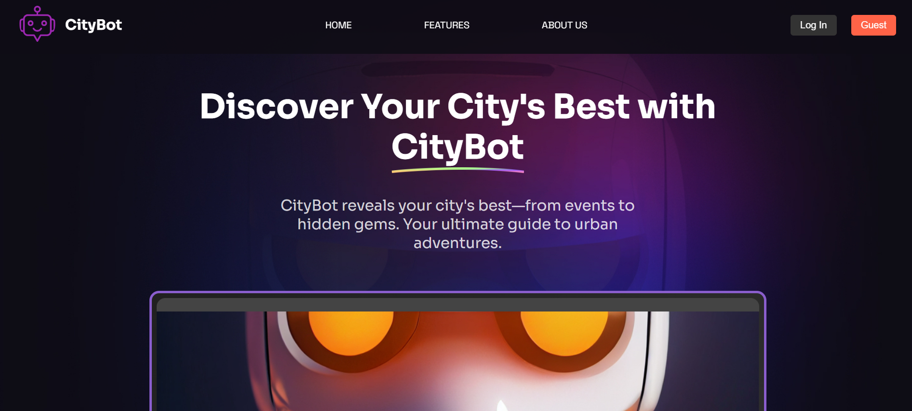
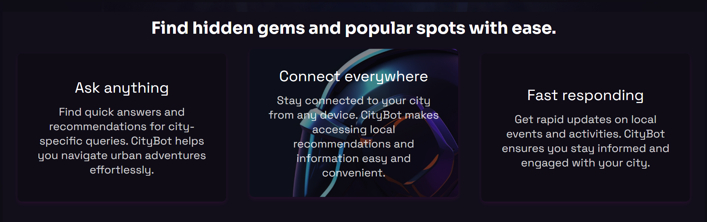
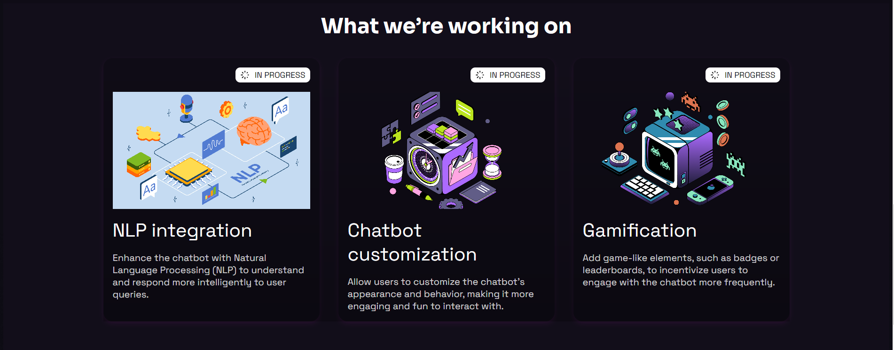
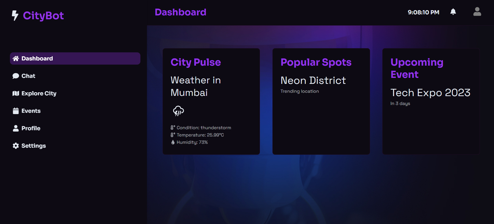
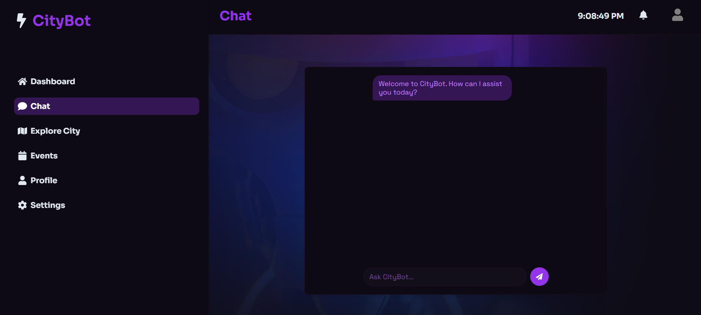

# CityBot








## Table of Contents
1. 🤖 [Introduction](#introduction)
2. ⚙️ [Tech Stack](#tech-stack)
3. 🔋 [Features](#features)
4. 🤸 [Quick Start](#quick-start)

## Introduction
CityBot is a chatbot designed to provide users with information about various events, such as concerts, exhibitions, and theatre plays. Its goal is to make it easier for users to discover local activities and services.

## Tech Stack
- Frontend: React
- Backend: Node.js, Express.js
- Database: MySQL
- API Testing: Postman

## Features
- Interactive event searching
- User-friendly interface
- Support for various event types
- Dynamic response generation

## Quick Start

To get started with CityBot locally, follow these steps:

1. Clone the repository: 
   ```bash
   git clone https://github.com/yourusername/citybot.git
   
2. Navigate to the project directory:
  ```bash
   cd citybot

4. Install dependencies for the backend:
  ```bash
   cd backend
   npm install

5. Start the backend server:
   ```bash
   npm start

6. Open the frontend project in a separate terminal:
   ```bash
   npm run dev

7. Open the backend project in a separate terminal:
    ```bash
   cd backend
   npm run dev

   ```bash
   Note: Deployment is currently in progress. Instructions will be provided once the project is live.
   

   

